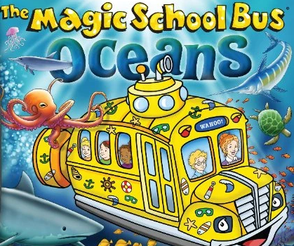

##### Download

+ [Paper](/papers/paper2/paper2.pdf) 

---

##### Abstract

The Magic School Bus travels to the Ocean floor, and the Mariana Trench to better understand Sub-Threshold Voltage. In this high impedance Ocean, the analogy of low-power computation is made, along with comparison to Morse lamps and SeaLab 2021. Like the quote, "Do fish know they're wet?," impedance is compared to hydrostatic pressure.
